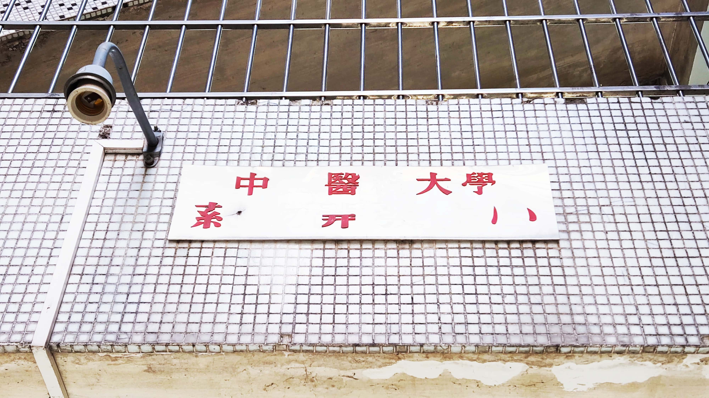

# Escaping-SYSU

SYSU 差生自救指南

## 简介

本 repo 是一个经验帖合集：主要面向临床医学专业的 SYSU 差生自救指南。

关于经验帖，GitHub 上已有不少项目珠玉在前
(
[1](https://github.com/sysuexam/SYSU-Exam)
[2](https://github.com/ysyisyourbrother/SYSU_Notebook)
[3](https://github.com/SleepingMonster/SYSU_Courses)
etc.
)，
但它们一方面均面向计算机专业，另一方面主要是以优等生的视角做出建议。

作为一个在退学边缘把一切流程走遍的极致差生 (详见 [关于我](#关于我) 章节)，
本 repo 旨在为处在各个阶段的学习困难生提供急救以及改善预后的方案。

## 一般治疗

* 本科生手册
* 自律性差怎么办

## 阶段建议

当遇上某个阶段时该怎么做

* 分流
* 降级
* 延毕
* 结业

## 考试经验

* 关于补考
* 公共课程
* 基础课程
* 临床课程
* 实习
* 毕业考

## 其他建议

* 我应该转行吗

## 关于我

## 声明

1. 本 repo 依照 [CC BY-NC-SA 4.0](https://creativecommons.org/licenses/by-nc-sa/4.0/) 协议开源
2. 在此基础上，本 repo 拒绝下列类别人员以任何形式使用：官二代、富二代、有恋爱史者、非学习困难生
   

     
详细……

     非学习困难生，即5分制GPA高于 y = 4 - 1.2ln(x) 者
     晚点再写
   

3. 欢迎 (非上述类别者) 提交 issues 或 pull requests
